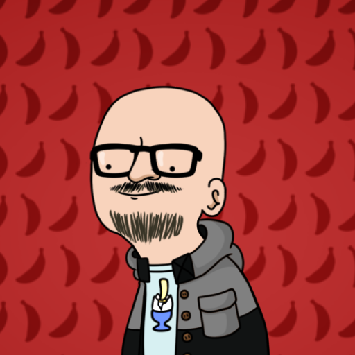
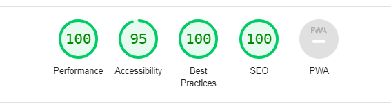

#  Designo Project

@Becode

    In this exercise we have integrated the model of a figma design with the "pixel perfect" mentality.
    We started by making the parts in common with live share and then compartmentalizing the rest of the project as a sub-task that we then attributed to each of us.
    Communication was the key to this project.

[The Figma mockup](https://www.figma.com/file/l95gv4piXhWCegSRZIXe3y/designo-becode?node-id=0%3A1)

 

## &#128101; Group

_No one can whistle a symphony. It takes a whole orchestra to play it._ - H.E. Luccock

 | | Quentin | |

 | | Olivier | |

 | | Antoine | |

  

[Our Web site](https://quentinmotte.github.io/designo/)

 

## Method

At first we organize our folders and files system and share out the work to manage to never have conflicts.  
And we have communicate A LOT !!

 

## 🛠️ The tools we used

### **Languages :**  

-   HTML 
-   CSS 
-   SASS 
-   JS

### **Software and programs :**  

-   VScode 
-   Live Share 
-   Live Sass 
-   GitHub 
-   GitBash

 

## &#128200; Lighthouse

 
 

|                 | Performance | Accessibility | Best Practices | SEO |
| --------------- | ----------- | ------------- | -------------- | --- |
| Moyenne Desktop | 100%        | 93%           | 99%            | 98% |
| Moyenne Mobile  | 96%         | 93%           | 87%            | 99% |

 

## What we can improve for our projects

-   BEM methodology
-   Mixins
-   ...

 

## Instructions

&#9745; Observe the design carefully, you need to follow it strictly!

&#9745; The website has to be responsive.

&#9745; To help you to set up a naming convention for your classes in CSS we recommend to use the BEM methodology.

&#9745; The website has to respond to the w3c validator.

&#9745; Pay attention to your SEO (The Lighthouse extension can help you).

&#9745; You must use Sass.

&#9745; Think about some nice CSS effects/animations.

&#9745; Make sure the site is BUG FREE.

&#9745; Respect the deadline.

&#9745; Everyone in the team must code.

 

### For GitHub

&#9745; Write a good README

&#9745; Mention a description and the website URL on the top of the repository

 

### Bonus

&#9745; Use a scroll to top button at the right bottom of the pages.

&#9745; In tablet and mobile mode, there must be a functional hamburger menu.

&#9745; Hide the menu when scroll down in the page and display it when scroll up. Take example on this website

&#9744; Use a slighty parallax effect for some images (Example).

 

### Plus

-   favicon
-   link home on logo
-   intermidiate media querry
-   link in About and Contact pages target specific section on Locations page
-   animation scroll up
-   zoom on hover
